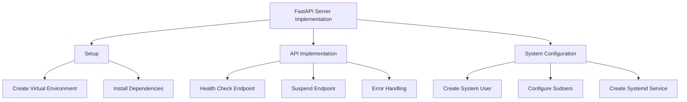

# FastAPI Server Implementation Plan



## 1. Setup

### 1.1 Create Virtual Environment

```bash
python3 -m venv /opt/server-dashboard/env
source /opt/server-dashboard/env/bin/activate
```

### 1.2 Install Dependencies

```bash
pip install fastapi uvicorn
```

## 2. API Implementation

### 2.1 Health Check Endpoint (/api/hc)

```python
from fastapi import FastAPI

app = FastAPI()

@app.get("/hc")
async def health_check():
    return {"status": "online"}
```

### 2.2 Suspend Endpoint (/api/suspend)

```python
import subprocess
from fastapi import HTTPException
from fastapi.responses import JSONResponse

@app.post("/api/suspend")
async def suspend():
    try:
        subprocess.run(["sudo", "systemctl", "suspend"], check=True)
        return JSONResponse(
            status_code=200,
            content={"status": "suspending"}
        )
    except subprocess.CalledProcessError as e:
        raise HTTPException(
            status_code=500,
            detail=f"System suspend failed: {str(e)}"
        )
```

### 2.3 Error Handling and Logging

```python
import logging
from fastapi.exception_handlers import http_exception_handler

logging.basicConfig(filename='server.log', level=logging.INFO)

@app.exception_handler(Exception)
async def custom_exception_handler(request, exc):
    logging.error(f"Error occurred: {str(exc)}")
    return await http_exception_handler(request, exc)
```

## 3. System Configuration

### 3.1 Create System User

```bash
sudo useradd -r -s /bin/false -m -d /opt/server-dashboard server-dashboard
```

### 3.2 Configure Sudoers

Create /etc/sudoers.d/server-dashboard with:

```
server-dashboard ALL=(root) NOPASSWD: /bin/systemctl suspend
```

### 3.3 Create Systemd Service

Create /etc/systemd/system/server-dashboard.service:

```
[Unit]
Description=Server Dashboard API
After=network.target

[Service]
User=server-dashboard
Group=server-dashboard
WorkingDirectory=/opt/server-dashboard
ExecStart=/opt/server-dashboard/env/bin/uvicorn backend.api:app --host 0.0.0.0 --port 8000
Restart=always

[Install]
WantedBy=multi-user.target
```

Enable and start service:

```bash
sudo systemctl daemon-reload
sudo systemctl enable server-dashboard
sudo systemctl start server-dashboard
```
